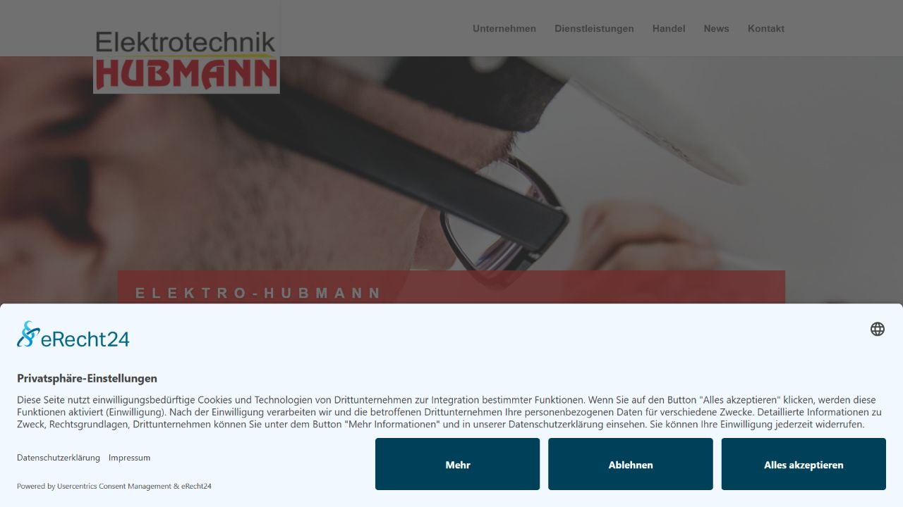
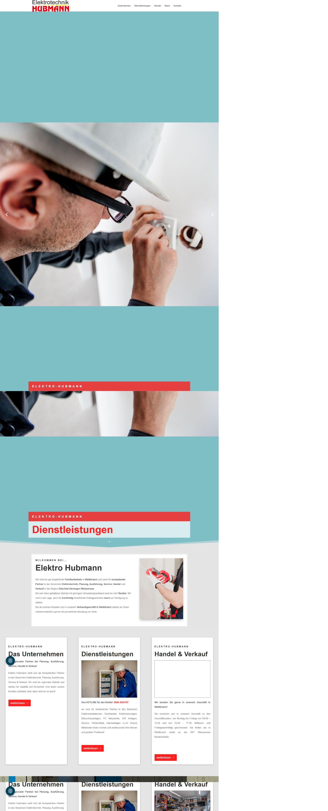
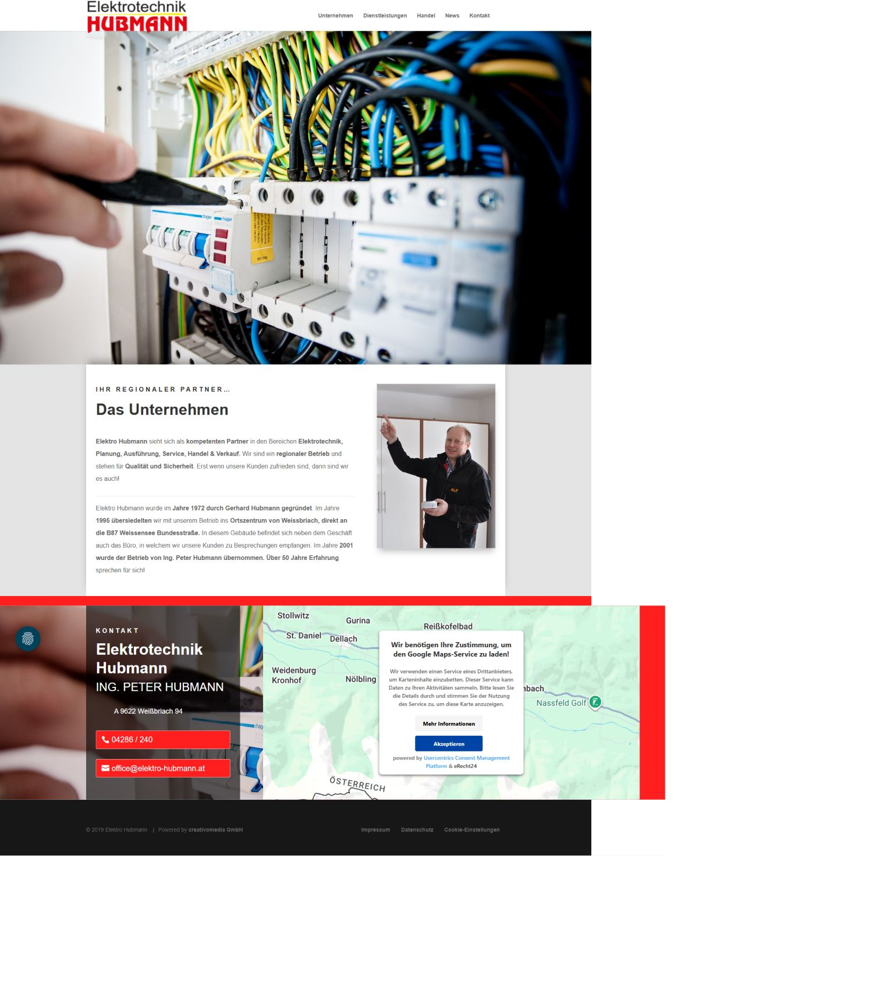
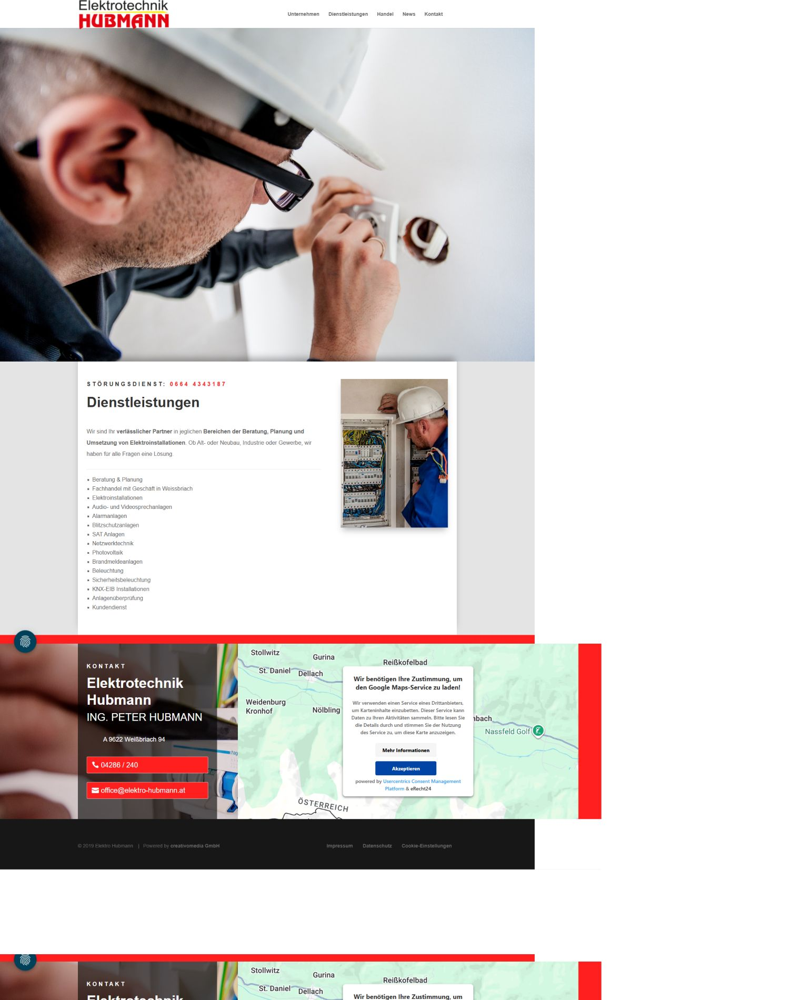
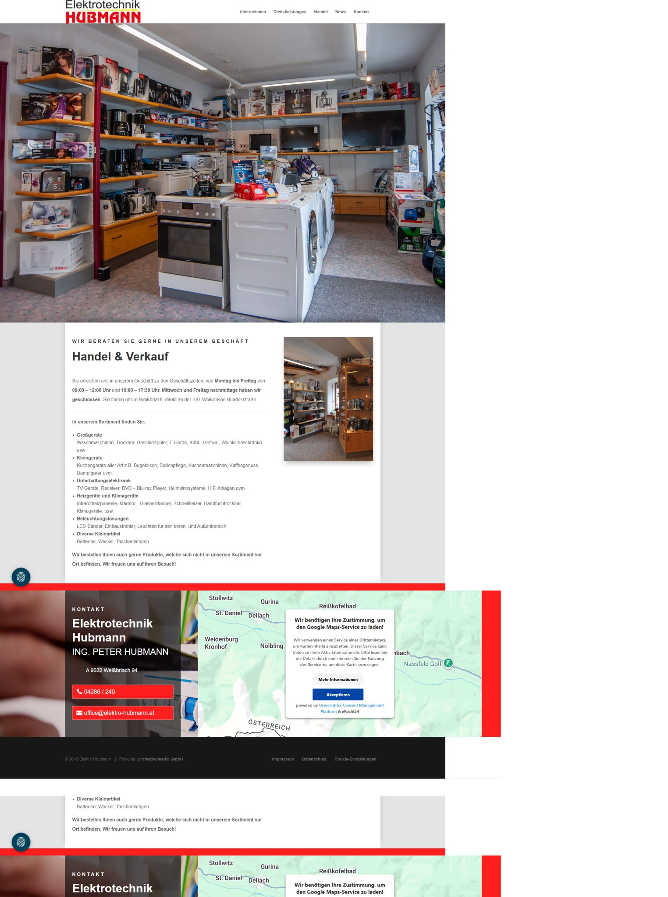
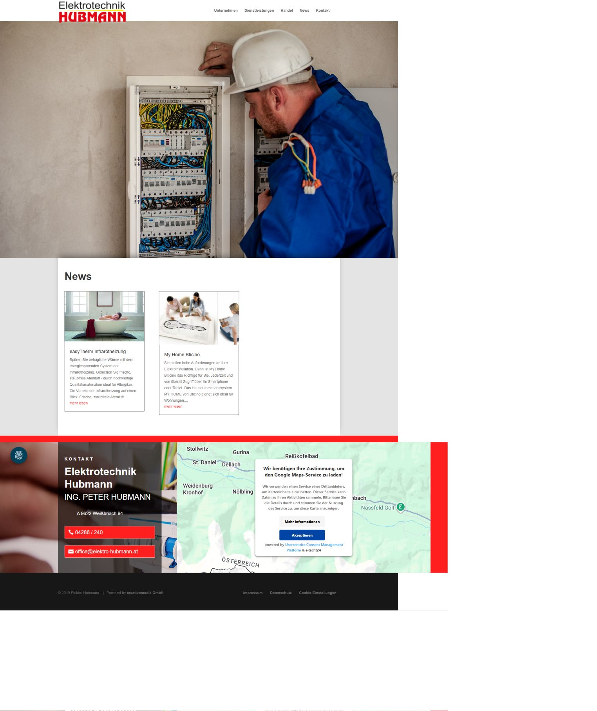
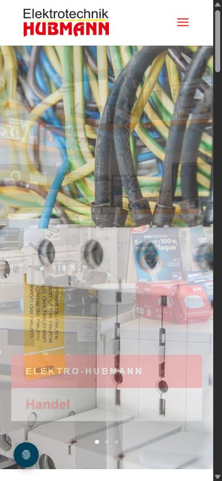
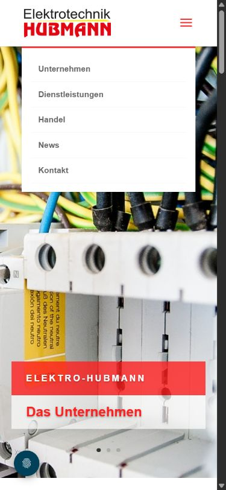
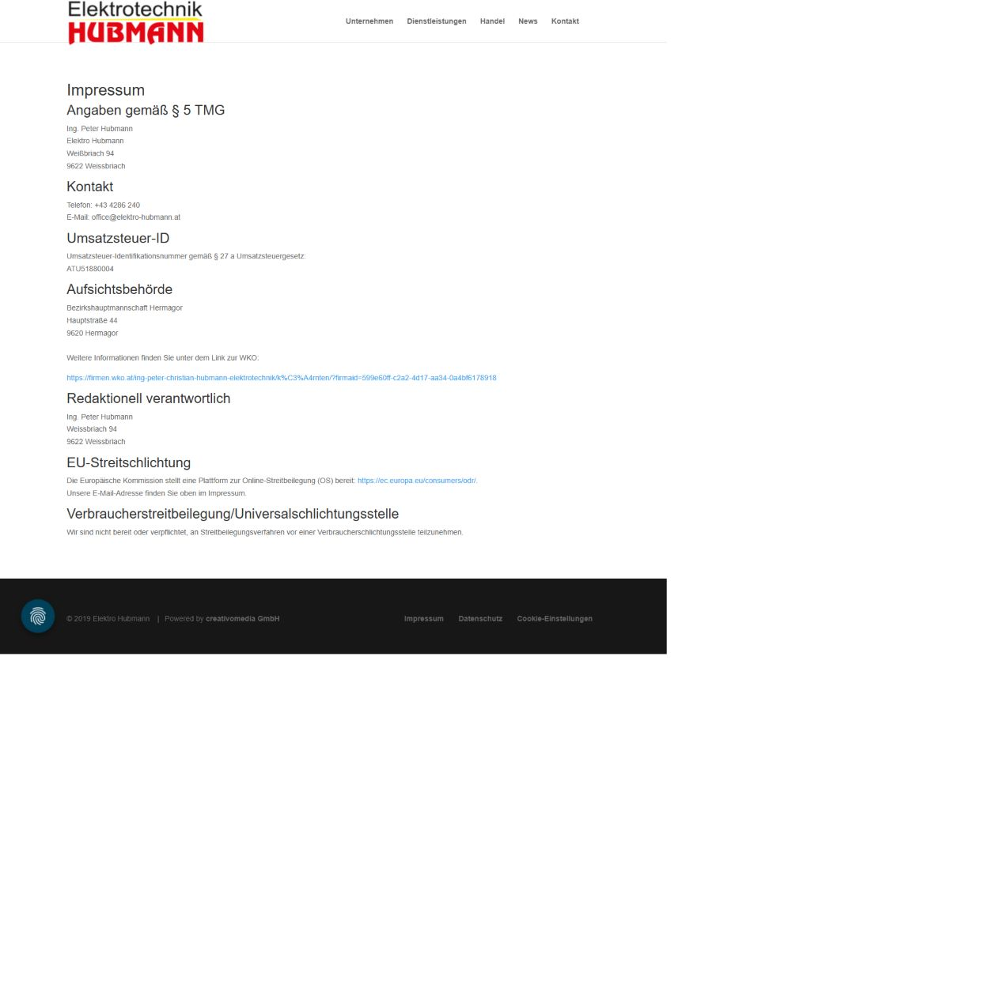
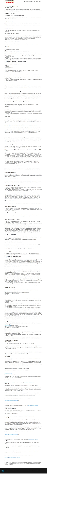

# Bestandsanalyse der bestehenden Website

Stand: 29. August 2026  
Geprüfte Website: <https://elektro-hubmann.at/>

## 1. Umfang und Methode

Geprüft wurden Startseite, Unternehmen, Dienstleistungen, Handel, News,
Mobilansicht, mobile Navigation, Impressum und Datenschutzerklärung. Zusätzlich
wurden öffentlich sichtbare DNS-Einträge, Meta-Daten, strukturierte Daten und
die geladenen Website-Ressourcen erfasst.

Die Analyse ist eine technische und konzeptionelle Bestandsaufnahme, keine
Rechtsberatung und keine vollständige WCAG-Prüfung. Aussagen zu Tastatur,
Screenreadern, Formularversand, Serverkonfiguration und internen Providerdaten
müssen später mit Zugang zur Technik verifiziert werden.

## 2. Gesamturteil

Die Website enthält die wesentlichen Unternehmensinformationen und verwendet
echte, lokale Bilder. Sie vermittelt jedoch keinen zeitgemäßen, fokussierten
Einstieg und verschenkt besonders auf Mobilgeräten Vertrauen und Anfragen. Der
visuelle Aufbau ist stark gealtert, die wichtigsten Handlungen sind nicht klar
priorisiert, mehrere semantische und rechtliche Inhalte sind problematisch und
die technische Abhängigkeit von einem alten WordPress-/Divi-Aufbau ist hoch.

Ein sauberer Neubau ist sinnvoller als eine schrittweise optische Reparatur.
Die vorhandenen Texte, Bilder und URLs bleiben dabei wertvolle Quellen, dürfen
aber nicht ungeprüft übernommen werden.

## 3. Audit-Schritte und Evidenz

### Schritt 1 – Erstbesuch und Cookie-Dialog: kritisch

Der Dialog ist rechtlich grundsätzlich sinnvoll und bietet „Ablehnen“ gleichwertig
an. Er nimmt beim ersten Besuch jedoch einen sehr großen Teil des sichtbaren
Bereichs ein. Der dahinterliegende Einstieg besitzt keine sofort erkennbare
Handlungsaufforderung.

### Schritt 2 – Startseite Desktop: kritisch

Die Seite arbeitet mit einem großen automatisch wechselnden Slider, langen
Leer-/Farbflächen und mehreren wiederholten Inhaltsblöcken. Telefonnummer,
Störungsdienst und Projektanfrage sind nicht als klare primäre Wege aufgebaut.
Die realen Fotos und die regionale Positionierung sind brauchbare Grundlagen.

### Schritt 3 – Unternehmen: verbesserungsbedürftig

Die Unternehmensgeschichte seit 1972 und die namentliche Ansprechperson schaffen
Vertrauen. Es fehlen eine H1, Team-/Qualifikationsnachweise, ein klarer nächster
Schritt und eine zeitgemäße, besser lesbare Darstellung.

### Schritt 4 – Dienstleistungen: kritisch

Die Leistungen sind als lange Liste vorhanden. Es fehlen verständliche Cluster,
Nutzenargumente, typische Einsatzfälle, Referenzen und klare Anfragen pro
Leistungsbereich. Der Störungsdienst ist sichtbar, aber nicht konsequent als
dringender Kontaktweg gestaltet. Auch diese Seite hat keine H1.

### Schritt 5 – Handel und Verkauf: verbesserungsbedürftig

Sortiment, Standort und Öffnungszeiten sind vorhanden. Für Ladenbesucher fehlen
ein fokussierter Weg zu Anfahrt/Öffnungszeiten, aktuellere Verkaufsraumfotos und
eine klare Information, was lagernd ist und was bestellt werden kann.

### Schritt 6 – News: kritisch

Es existieren nur zwei Beiträge. Beide wurden im März 2019 veröffentlicht und
zuletzt im März 2019 geändert. Ein prominent verlinkter „News“-Bereich mit so
alten Inhalten schwächt den Eindruck eines aktiven Betriebs. Für die neue Seite
sind echte Projekte/Referenzen wertvoller; „Aktuelles“ sollte nur in die
Hauptnavigation, wenn es regelmäßig gepflegt wird.

### Schritt 7 – Startseite Mobil: kritisch

Der automatisch wechselnde Slider dominiert den ersten Bildschirm. Während des
Übergangs überlagern sich Motive und Texte. Weder Störungsnummer noch Anfrage
oder Öffnungszeiten sind ohne Scrollen erreichbar.

### Schritt 8 – Mobile Navigation: verbesserungsbedürftig

Die Ziele sind nach dem Öffnen verständlich. Der Menüauslöser ist technisch nur
ein leeres `span` ohne Button-Rolle und ohne zugängliche Beschriftung; das ist
ein konkretes Risiko für Tastatur- und Screenreader-Nutzung.

### Schritt 9 – Impressum: kritisch, juristisch prüfen

Das Impressum nennt österreichische Unternehmensdaten, verwendet aber deutsche
Rechtsverweise („§ 5 TMG“, „§ 27 a Umsatzsteuergesetz“) und verweist auf die
inzwischen eingestellte EU-ODR-Plattform. Für eine österreichische kommerzielle
Website sind insbesondere ECG, GewO/UGB und MedienG relevant. Der genaue Inhalt
hängt von Rechtsform, Firmenbucheintragung, Gewerbe und Website-Inhalt ab.

### Schritt 10 – Datenschutzerklärung: kritisch, juristisch prüfen

Die Erklärung ist umfangreich, enthält aber mehrere Hinweise, die nicht zum
sichtbaren Ist-Zustand passen oder verifiziert werden müssen: IONOS-Hosting,
Kontaktformular, Zahlungsverkehr, Google Tag Manager und weitere Dienste. Die
öffentlichen DNS-Signale passen nicht eindeutig zur Hosting-Angabe. Ein
generischer Rechtstext ist kein Ersatz für eine tatsächliche Datenflussanalyse.

## 4. Stärken, die erhalten werden sollten

- erkennbare regionale Verankerung in Weißbriach, Gitschtal, Hermagor und
  Weißensee;
- Familienbetrieb, Gründung 1972 und über 50 Jahre Erfahrung;
- persönliche Ansprechperson;
- echte Fotos aus Betrieb, Geschäft und Arbeit;
- anklickbare Festnetz-, Mobil- und E-Mail-Kontakte;
- Störungsnummer, Öffnungszeiten, Sortiment und Leistungsbreite sind vorhanden;
- Google Maps wird erst nach Einwilligung geladen;
- kanonische URLs, Meta-Beschreibungen und indexierbare Seiten sind vorhanden.

## 5. Priorisierte Befunde

### P0 – vor Veröffentlichung lösen

1. **Rechtstexte passen nicht zuverlässig zu Österreich und zum Ist-Zustand.**
   Das Impressum verwendet deutsche Rechtsverweise; der ODR-Link ist seit
   20. Juli 2025 obsolet. Datenschutzerklärung und reale Dienste müssen anhand
   eines Datenfluss-Inventars abgeglichen werden.
2. **Systemverantwortung ist noch nicht geklärt.** Registrar, DNS, Webhosting
   und Microsoft-365-Tenant müssen inklusive Vertragsinhaber, Admin-Zugängen,
   2FA und Wiederherstellung getrennt dokumentiert werden.
3. **E-Mail-Authentifizierung ist unvollständig.** Öffentlich sichtbar sind SPF
   und Microsoft-365-MX, aber kein DMARC-TXT und keine üblichen Microsoft-365-
   DKIM-Selectoren. Vor jeder Mailmigration muss die Lage im Tenant geprüft
   und anschließend kontrolliert gehärtet werden.
4. **Hohe DNS-TTLs erschweren einen schnellen Rollback.** Relevante Records
   stehen derzeit überwiegend auf 86.400 Sekunden (24 Stunden).

### P1 – im Neubau lösen

1. Keine klare Hauptaktion im ersten Bildschirm: Störung, Projektanfrage und
   Geschäft werden nicht sauber getrennt.
2. Der Kontakt-Menüpunkt verwendet eine `http://`-URL und erzeugt einen
   unnötigen Redirect auf HTTPS.
3. Unterseiten „Unternehmen“, „Dienstleistungen“, „Handel“ und „News“ besitzen
   keine H1.
4. Automatische Sliderbewegung erschwert Orientierung und erzeugt auf Mobil
   sichtbare Überblendungen.
5. Mehrere Slider-/Karussell-Links haben nur Zahlen oder keinen verständlichen
   Namen; mehrere Bilder besitzen leere Alt-Texte.
6. Die mobile Menüschaltfläche hat keine Button-Semantik oder Beschriftung.
7. Fließtext ist überwiegend 14 px und auf langen Passagen zu klein.
8. Mehrere Social-Media-Symbole führen nur auf `#` und sollten entfernt oder mit
   echten Profilen verknüpft werden.
9. Es fehlt ein eigener Kontaktbereich mit strukturierten Wegen für Notfall,
   Projektanfrage und Geschäftsbesuch.
10. Strukturierte Daten enthalten Website/Breadcrumb/Article, aber kein
    verifiziertes `LocalBusiness`/`Electrician`-Profil; ein Open-Graph-Bild fehlt.

### P2 – optimieren

1. Das sichtbare System ist WordPress mit Divi Child Theme, Divi 4.27.5,
   jQuery/jQuery UI, Sticky Side Buttons, Font Awesome und Usercentrics.
2. Im geprüften Startseitenzustand wurden 23 Skripte, 5 Stylesheets und 11
   Bilder inventarisiert. Das ist für eine kleine Unternehmenswebsite unnötig
   komplex und erhöht Pflege- und Fehlerrisiko.
3. Die Navigation bietet eine Suche, obwohl der kleine Inhaltsumfang keine
   Suche benötigt.
4. `News` mit zwei Beiträgen von 2019 sollte durch gepflegte Projekte/Referenzen
   ersetzt oder aus der Hauptnavigation entfernt werden.
5. Kein öffentlicher CAA-Record, keine sichtbare DNSSEC-Delegation, kein
   MTA-STS- oder TLS-RPT-Record. Diese Punkte sind nach dem Providerentscheid
   kontrolliert zu bewerten, nicht blind am Launch-Tag zu aktivieren.

## 6. Aktueller öffentlicher Technik- und DNS-Bestand

Momentaufnahme vom 29. August 2026; vor jeder Änderung erneut exportieren.

| Bereich | Beobachtung | Bedeutung |
|---|---|---|
| Web A (`@`) | `152.53.64.181`, TTL ca. 86.400 | aktuelles Webziel |
| Web A (`www`) | `152.53.64.181`, TTL 86.400 | `www` zeigt auf dasselbe Ziel |
| Nameserver | `ns1.antagus.de`, `ns2.antagus.de` | DNS wird dort autoritativ verwaltet |
| MX | `elektrohubmann-at01i.mail.protection.outlook.com`, Priorität 0 | eingehende E-Mail läuft über Microsoft 365 |
| SPF | `v=spf1 include:spf.protection.outlook.com -all` | nur Microsoft 365 darf laut SPF senden |
| Microsoft-Verifikation | `MS=ms21158600` | Domain ist/war in Microsoft 365 verifiziert |
| Autodiscover | CNAME zu `autodiscover.outlook.com` | Clients werden zu Microsoft 365 geführt |
| DMARC | kein TXT unter `_dmarc` gefunden | Schutz/Reporting fehlt öffentlich |
| DKIM | keine CNAMEs unter `selector1/selector2._domainkey` gefunden | Microsoft-365-DKIM ist öffentlich nicht erkennbar |
| DNSSEC | kein DS-Record gefunden | derzeit keine öffentliche DNSSEC-Delegation erkennbar |
| CAA | kein Record gefunden | Zertifizierungsstellen sind nicht eingeschränkt |

Mehrere nicht definierte Hostnamen (`mail`, `autoconfig`, `_dmarc`) lösten auf
dieselbe Web-IP auf. Das deutet auf einen Wildcard-A-Record hin und muss im
vollständigen Zonenexport bestätigt werden. Ein A-Record unter `_dmarc` ist
kein DMARC-Ersatz.

Die Datenschutzerklärung nennt IONOS als Hoster, während DNS, Reverse-DNS und
Nameserver andere öffentliche Signale liefern. Daraus darf kein eindeutiger
aktueller Vertragspartner abgeleitet werden; Verträge und Admin-Portale sind
maßgeblich.

## 7. Bestehende Inhalte und empfohlene Behandlung

| Altinhalt | Entscheidung für Neubau |
|---|---|
| Startseite | komplett neu strukturieren; Kernaussagen übernehmen und redigieren |
| Unternehmen | Geschichte seit 1972 erhalten; Team, Qualifikation, Werte ergänzen |
| Dienstleistungen | in 5–7 verständliche Leistungscluster aufteilen |
| Handel | behalten; Öffnungszeiten und Sortiment verifizieren |
| Störungsdienst | als sofort erkennbare, mobile Telefonaktion hervorheben |
| News | nicht 1:1 übernehmen; alte Beiträge nur bei sachlicher Aktualität migrieren |
| Kontaktblock | eigene Kontaktseite plus kompakter Footer; Daten verifizieren |
| Impressum | neu nach österreichischer Rechtslage und tatsächlicher Rechtsform erstellen |
| Datenschutz | aus realem Datenfluss und tatsächlichen Dienstleistern neu erstellen |
| alte Bilder | Rechte, Aktualität, Auflösung und Einwilligungen einzeln prüfen |

## 8. Quellen und Beleggrenzen

- Aktuelle Website und gespeicherte Screenshots vom 29. August 2026.
- [WKO: Informationspflichten nach dem ECG](https://www.wko.at/internetrecht/informationspflichten-nach-dem-e-commerce-gesetz--dem-unte)
- [WKO: Informationspflichten nach dem Mediengesetz](https://www.wko.at/internetrecht/informationspflichten-nach-dem-mediengesetz-fuer-websites)
- [EU-Kommission: Einstellung der ODR-Plattform](https://consumer-redress.ec.europa.eu/site-relocation_en)
- [Microsoft: SPF, DKIM und DMARC](https://learn.microsoft.com/en-us/defender-office-365/email-authentication-spf-configure)
- [nic.at: Whois und Registrar-Prüfung](https://www.nic.at/de/meine-at-domain/domain-suche/whois)

Die gespeicherten Full-Page-Screenshots können bei bewegten oder fixierten
Seitenelementen Wiederholungen zeigen. Befunde zu tatsächlichen Dopplungen wurden
daher zusätzlich gegen DOM-Inhalt und normale Viewport-Screenshots abgeglichen.

