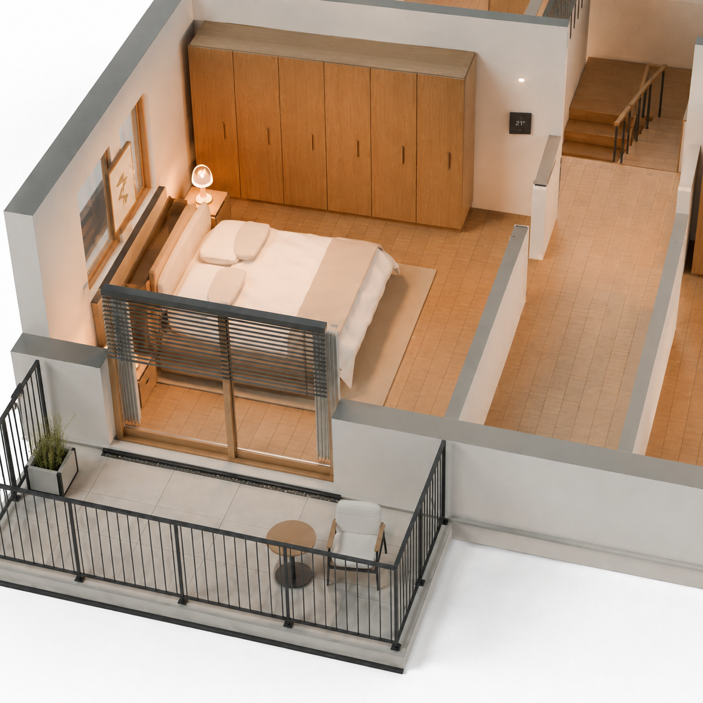
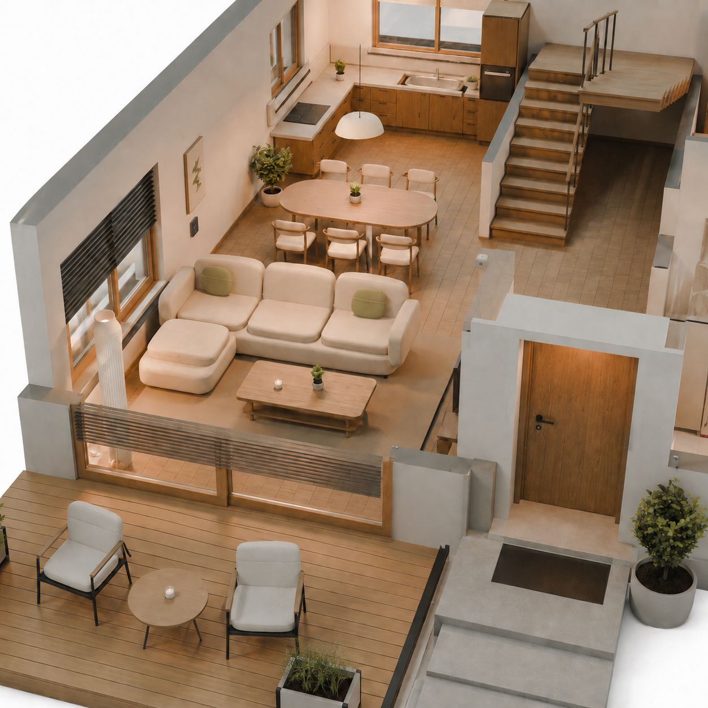

# Smart Home – Modell-Mockups R1

Zwei Bildkonzepte mit dem eingebauten ImageGen-Werkzeug, aus nativen
Cycles-Renderings des B-Hauses mit Balkon und Holzfenstern abgeleitet.
Die Bilder sind Konzept-Mockups, keine neuen Blender-Renderings oder
fertigen Animationsframes. Der Grundriss der Blender-Datei bleibt maßgeblich.
Vollständige Prompts und Referenzpfade stehen in `prompts.json`.

## A – Schlafzimmer und Balkon (Empfehlung)

Die Kamera fährt aus der OG-Übersicht näher an das Elternschlafzimmer.
Raumregler, verstellbare Raffstore-Lamellen und Balkontür sind gemeinsam
sichtbar. Bett, Schrank, Holzfenster und das schwarze Balkongeländer bleiben
als Anker des vorhandenen Modells erkennbar.

Vorgeschlagene Bewegung: Die Kamera nähert sich dem Regler und der Balkontür,
anschließend verstellen sich die Lamellen. Das warme Licht bleibt an.
Beim Zurückscrollen laufen Kamera und Beschattung vollständig rückwärts.
Danach zieht sich die Kamera zum Schließen des Hauses und zur Türstation
zurück. Diese Richtung erhält den bestehenden Wechsel vom EG ins OG.

Für die native Umsetzung einen kleinen Raumregler auf der Innenwand neben
der Schlafzimmertür modellieren und die vorhandene Beschattung um echte,
drehbare Lamellen ergänzen. Die im Bild vorgeschlagene Sensorposition an
einer Schnittkante ist im nativen Modell an einer realen Decke zu lösen.
Die Temperaturanzeige ist eine illustrative Modellanzeige, keine Live-Messung.

## B – Wohnbereich

Die Kamera rückt an Sofa und Essbereich im vorhandenen EG heran. Ein
Raumregler an der linken Innenwand steuert die Beschattung an Wohnraum-
und Terrassenfenster. Die Beleuchtung bleibt auch hier bereits eingeschaltet.
Der zunächst außen generierte Regler wurde gezielt nach innen versetzt.

Diese Richtung vermittelt eine Alltagsszene, würde aber einen neuen Ablauf
zwischen Installation und Sicherheit benötigen, damit das Obergeschoss
weiterhin gezeigt wird. A passt deshalb besser zur bestehenden Geschichte.

## Auswahl und Umsetzung

Leon hat Variante A zur Umsetzung freigegeben. Sie ist in eigenen nativen
Blender-Dateien umgesetzt; Kamera, Regler und Lamellen sind modelliert und
animiert. Technische Details und Reproduktion: `../../17-haus-v4-smarthome.md`.

## Website und Renderstand

Der separate Beleuchtungsschritt wurde aus Kapiteldefinition, Navigation,
Zähler und statischer Ersatzansicht entfernt. Die fünf Kapitel sind Planung,
Installation, Smart Home, Sicherheit und Photovoltaik. Beide Blender-Exporter
verwenden dieselbe aktualisierte Kapiteldefinition. Native Kamerapositionen,
Frame-Zuordnung und die Identität des laufenden B-Renders bleiben unverändert.
Die fertige native Smart-Home-Folge wird nach vollständiger Render- und
Exportprüfung aktiviert; die durchgehende Animation bleibt dabei erhalten.
